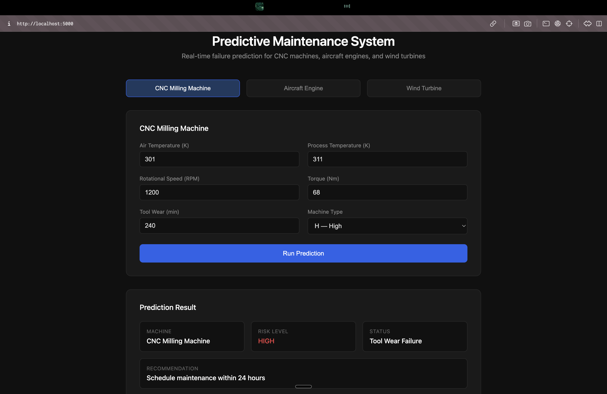

# AI-Driven Predictive Maintenance System

Predict equipment failure before it happens using real sensor data and machine learning — across multiple machine types through a unified web dashboard.

---

## Why This Project Exists

Unplanned equipment failure costs industries billions annually in downtime, repairs, and lost productivity. Traditional maintenance is either reactive (fix after failure) or time-based (fix on a schedule), both of which are inefficient.

This project builds a data-driven alternative: a system that continuously analyzes sensor readings from equipment and predicts failure before it occurs. The result is maintenance that happens exactly when needed — not too early, not too late.

---

## Machines Covered

| Machine | Dataset | Prediction Target |
|---|---|---|
| CNC Milling Machine | AI4I 2020 (UCI / Kaggle) | Failure type — tool wear, heat, power, overstrain |
| Aircraft Engine | NASA CMAPSS FD001 (Kaggle) | Remaining Useful Life (RUL) in cycles |
| Wind Turbine | SCADA Dataset (Kaggle) | Anomaly detection via power deviation |

---

## Tech Stack

| Layer | Tool |
|---|---|
| Language | Python 3.10+ |
| Data Processing | Pandas, NumPy |
| Machine Learning | Scikit-learn, XGBoost |
| Visualization | Plotly, Seaborn |
| Backend API | Flask |
| Frontend | HTML, CSS, JavaScript |
| Environment | Jupyter Notebook |
| Version Control | Git + GitHub |
| Deployment | Render |

---

## Project Structure

```
predictive-maintenance/
│
├── data/
│   ├── README.md                         # Data sources and column documentation
│   ├── raw/                              # Original datasets (excluded from GitHub)
│   │   ├── cnc/
│   │   ├── aircraft_engine/
│   │   └── wind_turbine/
│   └── processed/
│       ├── cnc_cleaned.csv
│       ├── engine_cleaned.csv
│       └── wind_cleaned.csv
│
├── src/
│   ├── README.md
│   ├── preprocess.py                     # Data cleaning functions
│   └── train.py                          # Model training for all three machines
│
├── models/                               # Trained .pkl files (excluded from GitHub)
│
├── reports/
│   ├── README.md
│   ├── api_docs.md                       # Full API endpoint documentation
│   ├── api_testing_report.md             # Manual test results for all endpoints
│   ├── architecture.md                   # System architecture and data flow
│   ├── sequence_diagram.md               # Prediction and chat sequence diagrams
│   ├── data_cleaning_report.md           # Before and after cleaning summary
│   ├── deployment_report.md              # Local and production deployment steps
│   ├── final_report.md                   # Full project report
│   ├── figures/                          # Exported EDA charts
│   └── notebooks/
│       ├── 00_data_inspection.ipynb
│       ├── 01_data_cleaning.ipynb
│       ├── 02_cnc_eda.ipynb
│       ├── 03_engine_eda.ipynb
│       └── 04_turbine_eda.ipynb
│
├── deployment/
│   ├── README.md
│   ├── app.py                            # Flask backend — all API routes
│   ├── templates/
│   │   └── index.html                    # Frontend dashboard
│   └── static/
│       ├── style.css
│       └── script.js
│
├── .gitignore
├── requirements.txt
└── README.md
```

---

## How to Run

**1. Clone the repository**
```bash
git clone https://github.com/ishekaa12/predictive-maintenance-project.git
cd predictive-maintenance-project
```

**2. Install dependencies**
```bash
pip install -r requirements.txt
```

**3. Add raw datasets**

Download and place inside `data/raw/` before training:
- `data/raw/cnc/` — AI4I 2020 CSV from Kaggle
- `data/raw/aircraft_engine/` — NASA CMAPSS FD001 TXT from Kaggle
- `data/raw/wind_turbine/` — Wind Turbine SCADA CSV from Kaggle

**4. Train models**
```bash
python src/train.py
```

**5. Start the Flask server**
```bash
cd deployment
python app.py
```

**6. Open the dashboard**
```
http://localhost:5000
```

---

## API Endpoints

| Method | Endpoint | Description |
|---|---|---|
| GET | `/` | Serves the frontend dashboard |
| GET | `/health` | Returns server status and loaded models |
| POST | `/predict/cnc` | CNC failure prediction |
| POST | `/predict/engine` | Aircraft engine RUL prediction |
| POST | `/predict/turbine` | Wind turbine anomaly detection |
| POST | `/chat` | Ask a question, saves to history |
| GET | `/chat/history` | Returns full conversation history |
| POST | `/chat/clear` | Clears conversation history |

Full documentation in `reports/api_docs.md`

---

## Model Results

| Machine | Best Model | Metric | Score |
|---|---|---|---|
| CNC Milling Machine | XGBoost | F1 (failure class) | 0.77 |
| Aircraft Engine | XGBoost | F1 (at risk class) | 0.888 |
| Aircraft Engine | XGBoost | RUL MAE | 25.32 cycles |
| Wind Turbine | Logistic Regression | F1 (anomaly class) | 1.0 |

---

## Datasets

| Dataset | Source | Rows |
|---|---|---|
| AI4I 2020 Predictive Maintenance | [Kaggle](https://www.kaggle.com/datasets/stephanmatzka/predictive-maintenance-dataset-ai4i-2020) | 10,000 |
| NASA CMAPSS FD001 | [Kaggle](https://www.kaggle.com/datasets/behrad3d/nasa-cmaps) | 20,631 |
| Wind Turbine SCADA | [Kaggle](https://www.kaggle.com/datasets/berkerisen/wind-turbine-scada-dataset) | 50,473 |

---

## Demo

[Watch the demo video](your-link-here)

### Dashboard Preview



---

## Project Status

- [x] Week 1 — Data collection, cleaning, documentation
- [x] Week 2 — Flask API, frontend dashboard, architecture
- [x] Week 3 — EDA, feature engineering, model training
- [x] Week 4 — Model integration, error handling, chat history, testing
- [ ] Week 5 — Dashboard polish, comparative analysis report
- [ ] Week 6 — Render deployment, final report

---

## Contributor

Developed independently as a 6-week project under the guidance of the Automation Lab.